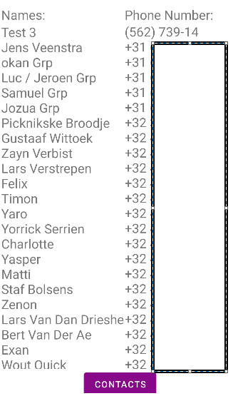

# MusicApp

## Use
- Use this app like a todolist but for music that you would like to listen to

## Info Content provider
- I did nto manage to create a custom CP with data out of my datatabse.
- so i used the contats app on my pixel emulator to grap and display the contacts in my app.
- PATH: settings>contacts
- 

## info fragment
- u used a fragment for a navigation bar at the bottin. 

## Info Style
- Prim colors:
  - purple
  - whiete text/backround/border
  - black text/background/borders
  - black and white change when u go to dark mode/light mode
- Extra screen size --> i used landscape

### Info Testing
- i made a test case to check if an song can be created and deleted
- it also checks navigation and checks if the fields are filled in correctly when u want to edit
- **!!!!! ATTENTION !!!!!**
- Make shure there are no songs in your list (home) else it will test false.

